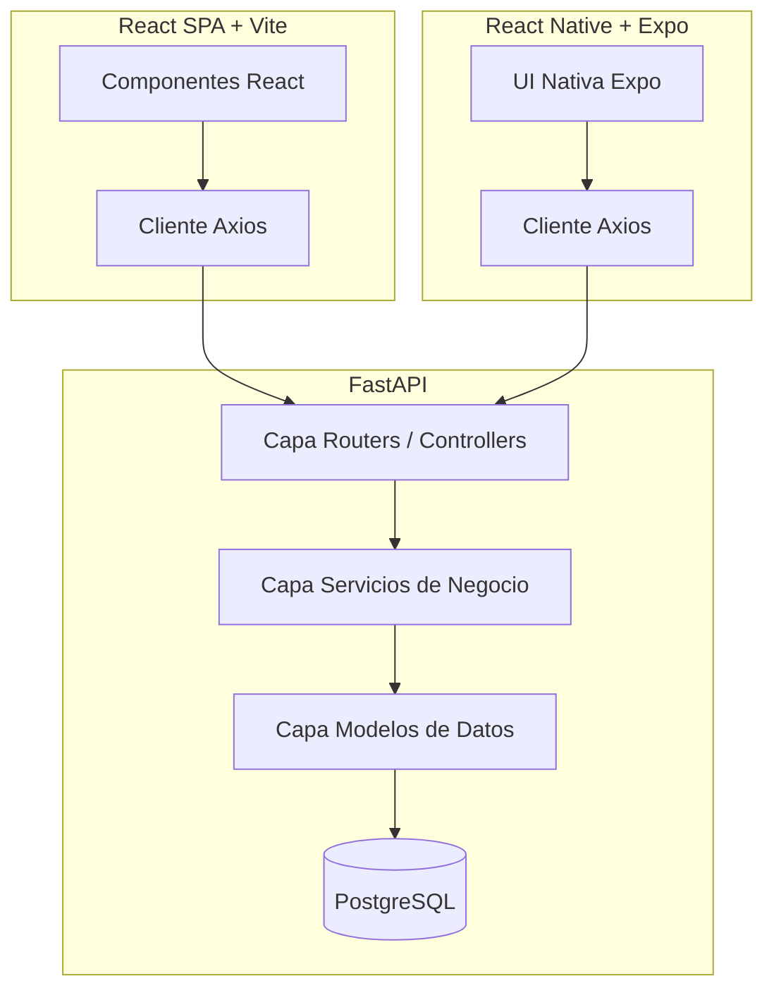

# 🎨 Jóvenes al Ruedo — Web & API

**Proyecto educativo — SENA, Ficha 3171599 | Junio 2026**

Plataforma de conexión cultural y bolsa de empleo que conecta a jóvenes artistas (de 18 a 28 años) con fundaciones, empresas y gestores culturales para promover el empleo y la visualización de talento emergente.

---

## 📋 Tabla de Contenidos

- [Descripción del Proyecto](#descripción-del-proyecto)
- [Novedades Recientes (Backlog Completado)](#novedades-recientes-backlog-completado)
- [Stack Tecnológico](#stack-tecnológico)
- [Estructura de la Base de Datos](#estructura-de-la-base-de-datos)
- [Prerrequisitos](#prerrequisitos)
- [Instalación y Configuración](#instalación-y-configuración)
- [Ejecución en Desarrollo](#ejecución-en-desarrollo)
- [Testing y Cobertura](#testing-y-cobertura)
- [Estructura del Repositorio](#estructura-del-repositorio)
- [Endpoints de la API](#endpoints-de-la-api)
- [Autores](#autores)

---

## 📖 Descripción del Proyecto

**Jóvenes al Ruedo** permite a las empresas y artistas dinamizar el ecosistema cultural:
- **Artistas:** Pueden registrarse con restricciones de edad (18-28 años), subir su portafolio con soporte multimedia enriquecido (música, videos, PDFs) y postularse rápidamente a convocatorias.
- **Empresas:** Pueden publicar convocatorias artísticas, administrar un tablero visual tipo **Kanban** para evaluar postulantes y filtrar perfiles por área artística o presupuesto.
- **Chat en Tiempo Real:** Ambos actores interactúan directamente mediante salas de chat bidireccionales con **WebSockets** y fallback automático por HTTP.

---

## 🚀 Novedades Recientes (Backlog Completado)

Hemos completado el backlog al 80%+ implementando:
1. **Gestor de Dependencias Ultra Rápido (`uv`):** Reemplazamos la gestión clásica de `pip` en el backend por `uv` (desarrollado en Rust por Astral) para instalación y ejecución de tests instantánea.
2. **Carga de Archivos Avanzada:** Soporte para carga de imágenes, audio y video con validación estricta de tamaños máximos (Videos max 50MB, Audios max 15MB, otros 10MB).
3. **Grid Multimedia en Web:** Dashboard de artista con reproductores embebidos de audio/video y visores de PDF.
4. **Filtros e Interfaces Kanban:** Buscador avanzado de ofertas y visualización de postulaciones en columnas de evaluación para empresas.
5. **Comunicaciones con WebSockets:** Chat instantáneo y bidireccional en el backend y frontend web con alertas de red personalizadas y reconexión automática de 3s.
6. **Robustez y Pruebas:** Middleware global de captura de errores y 36/36 unit tests en `pytest` pasando con éxito.

---

## 🛠️ Stack Tecnológico

### Backend (`be/`)
- **Python 3.12+**
- **FastAPI 0.115+** (Framework web asíncrono)
- **SQLAlchemy 2.0+** (ORM con PostgreSQL)
- **Alembic** (Migraciones de base de datos)
- **uv** (Gestor de entornos virtuales y paquetes de Astral)
- **Pytest** (Framework de testing)

### Frontend (`fe/`)
- **React 19** + **TypeScript**
- **Vite 7** (Desarrollo y compilación)
- **TailwindCSS 4** (Diseño visual moderno)
- **Axios** (Comunicaciones HTTP)
- **Lucide React** (Iconografía)

---

## 🗄️ Estructura de la Base de Datos

Entidades principales gestionadas por el ORM:
- **`users`:** Almacena artistas y empresas con sus perfiles correspondientes.
- **`conversacion`:** Administra canales de chat directo o creados mediante postulaciones.
- **`mensaje`:** Contiene los mensajes de chat leídos/no leídos con timestamps.
- **`convocatoria`:** Ofertas culturales publicadas por empresas.
- **`inscripcion`:** Relación de postulación de artistas a convocatorias.
- **`portafolio` / `portafolio_items`:** Contenedores de archivos multimedia de artistas.

---

## ✅ Prerrequisitos

- **Docker y Docker Compose** (para PostgreSQL)
- **Node.js 20 LTS+** y **pnpm 9+** (para el Frontend)
- **uv** (Instalación en Windows: `powershell -ExecutionPolicy ByPass -c "irm https://astral.sh/uv/install.ps1 | iex"`)

---

## 🚀 Instalación y Configuración

### 1. Clonar el repositorio
```bash
git clone https://github.com/JhoynerNova/Jovenes-Al-Ruedo.git
cd Jovenes-Al-Ruedo
```

### 2. Base de Datos (Docker)
Levanta el contenedor de PostgreSQL (mapeado al puerto local `5433` según el archivo `.env` del backend):
```bash
docker compose up -d
```

### 3. Configuración del Backend
Navega a `be`, sincroniza dependencias y ejecuta las migraciones iniciales de Alembic:
```bash
cd be
# Crear entorno virtual e instalar dependencias con uv de forma automática
uv sync

# Ejecutar migraciones de la base de datos
uv run alembic upgrade head
```

### 4. Configuración del Frontend
Navega a `fe` e instala dependencias:
```bash
cd ../fe
pnpm install
```

---

## ▶️ Ejecución en Desarrollo

### Servidor Backend (FastAPI)
Desde la carpeta `be/`:
```bash
uv run uvicorn app.main:app --reload
# -> Servidor corriendo en: http://localhost:8000
# -> Swagger interactivo en: http://localhost:8000/docs
```

### Cliente Web (React)
Desde la carpeta `fe/`:
```bash
pnpm dev
# -> Cliente web corriendo en: http://localhost:5173
```

---

## 🧪 Testing y Cobertura

### Backend
Para correr las pruebas unitarias y verificar el flujo del chat y websockets:
```bash
cd be
uv run pytest app/tests -v
```
**Resultado:** ✅ 36/36 tests pasando exitosamente.

### Frontend
Para ejecutar las pruebas en el cliente web:
```bash
cd fe
pnpm test
```

---

## 🏗️ Arquitectura del Sistema

El sistema adopta una arquitectura de **Cliente-Servidor desacoplada** estructurada bajo los principios de **Clean Architecture** (Arquitectura Limpia) y separación de responsabilidades:



### Capas del Backend (Clean Architecture):
* **Capa de Presentación (`app/routers`)**: Expone endpoints REST y WebSockets, valida entradas con Pydantic y delega a los servicios.
* **Capa de Lógica de Negocio (`app/services`)**: Contiene reglas de negocio (ej. validación de rango de edad, validación de tamaños multimedia).
* **Capa de Persistencia (`app/models`)**: Modelos ORM relacionales de SQLAlchemy.
* **Capa de Configuración y Seguridad (`app/core` & `app/utils`)**: Configuración con Pydantic Settings, JWT y hashing.

---

## 📂 Estructura del Repositorio

A continuación se detalla la estructura simplificada de este repositorio:

```text
Jovenes-Al-Ruedo/
├── be/                            # Backend — FastAPI + Python
│   ├── alembic/                   # Historial de migraciones SQL
│   ├── app/
│   │   ├── core/                  # Cookies y privacidad
│   │   ├── models/                # Modelos SQLAlchemy ORM
│   │   ├── routers/               # Controladores y Endpoints de la API
│   │   ├── schemas/               # Modelos de validación Pydantic
│   │   ├── services/              # Lógica de negocio (auth_service)
│   │   ├── tests/                 # Unit tests (test_auth, test_chat)
│   │   ├── utils/                 # Envíos de email y seguridad
│   │   ├── database.py            # Inicialización de motor de base de datos
│   │   ├── dependencies.py        # Dependencias inyectadas (current_user, get_db)
│   │   └── main.py                # Punto de entrada FastAPI y middleware global
│   ├── pyproject.toml             # Declaración de dependencias del backend para `uv`
│   └── requirements.txt           # Dependencias compiladas
├── db/                            # Scripts SQL puros (seed y schemas)
├── docs/                          # Carpetas de documentación técnica general
│   ├── conceptos/                 # Conceptos y glosarios
│   ├── referencia-tecnica/        # Endpoints, arquitectura, modelo de datos y diseño
│   └── requisitos/                # Historias de usuario (HUs), funcionales y restricciones
├── fe/                            # Frontend — React + Vite + TS
│   ├── src/
│   │   ├── api/                   # Clientes de Axios
│   │   ├── components/            # Layouts y componentes UI reutilizables
│   │   ├── context/               # Proveedor de estado de autenticación
│   │   ├── hooks/                 # Custom react hooks
│   │   ├── pages/                 # Vistas del dashboard, explore, chat, etc.
│   │   └── types/                 # Interfaces de tipos de TypeScript
│   ├── package.json               # Dependencias de npm
│   └── vite.config.ts             # Configuración de compilador Vite
├── docker-compose.yml             # Contenedor de base de datos PostgreSQL
└── README.md                      # Esta guía
```

---

## 🔌 Endpoints de la API

Base URL: `http://localhost:8000/api/v1`

### Autenticación (`/auth`)
- `POST /auth/register` - Registro de usuarios (validaciones de edad)
- `POST /auth/login` - Obtención de tokens de acceso JWT
- `POST /auth/change-password` - Cambio de contraseña con sesión activa
- `POST /auth/forgot-password` - Envío de código de recuperación por email
- `POST /auth/reset-password` - Reestablecer contraseña usando token

### Chat & WebSockets (`/chat`)
- `GET /chat/conversaciones` - Listado de conversaciones del usuario
- `POST /chat/conversaciones/directo` - Iniciar chat directo (Empresa a Artista)
- `GET /chat/conversacion/{id}/mensajes` - Historial de mensajes (marca no leídos como leídos)
- `POST /chat/conversacion/{id}/mensajes` - Enviar mensaje tradicional por HTTP
- `WebSocket /chat/ws/{id}` - Conexión bidireccional en tiempo real para chat interactivo

---

## 👥 Autores

- **Franky Almario** - Desarrollador
- **Jhoyner Nova** - Desarrollador

**SENA — Ficha 3171599 | Junio 2026**