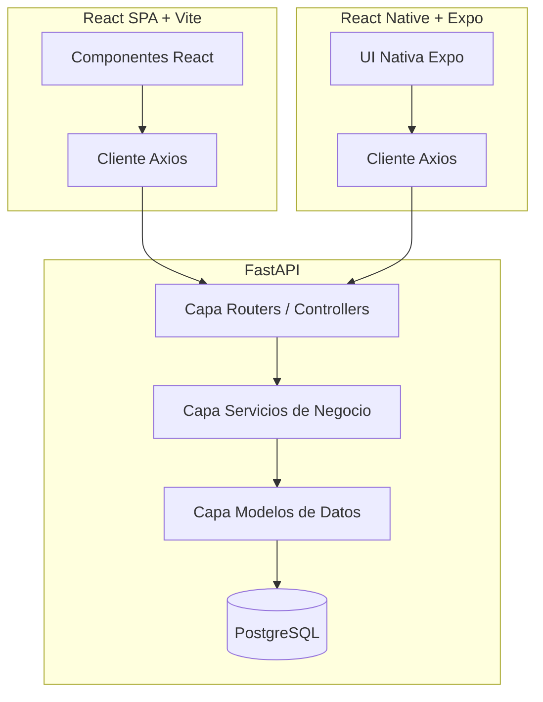

# 🎨 Jóvenes al Ruedo — Web & API

**Proyecto educativo — SENA, Ficha 3171599 | Junio 2026**

Plataforma de conexión cultural y bolsa de empleo que conecta a jóvenes artistas (de 18 a 28 años) con fundaciones, empresas y gestores culturales para promover el empleo y la visualización de talento emergente.

---

## 📋 Tabla de Contenidos

- [Descripción del Proyecto](#descripción-del-proyecto)
- [Novedades Recientes (Backlog Completado)](#novedades-recientes-backlog-completado)
- [Stack Tecnológico](#stack-tecnológico)
- [Estructura de la Base de Datos](#estructura-de-la-base-de-datos)
- [Prerrequisitos](#prerrequisitos)
- [Instalación y Configuración](#instalación-y-configuración)
- [Ejecución en Desarrollo](#ejecución-en-desarrollo)
- [Testing y Cobertura](#testing-y-cobertura)
- [Arquitectura del Sistema](#arquitectura-del-sistema)
- [Modelo Cliente-Servidor](#modelo-cliente-servidor)
- [API REST](#api-rest)
- [Patrón MVC](#patrón-mvc)
- [Patrones de Organización de Componentes (Frontend)](#patrones-de-organización-de-componentes-frontend)
- [Atomic Design](#atomic-design)
- [Comunicación con la API](#comunicación-con-la-api)
- [Estructura del Repositorio](#estructura-del-repositorio)
- [Endpoints de la API](#endpoints-de-la-api)
- [Autores](#autores)

---

## 📖 Descripción del Proyecto

**Jóvenes al Ruedo** permite a las empresas y artistas dinamizar el ecosistema cultural:
- **Artistas:** Pueden registrarse con restricciones de edad (18-28 años), subir su portafolio con soporte multimedia enriquecido (música, videos, PDFs) y postularse rápidamente a convocatorias.
- **Empresas:** Pueden publicar convocatorias artísticas, administrar un tablero visual tipo **Kanban** para evaluar postulantes y filtrar perfiles por área artística o presupuesto.
- **Chat en Tiempo Real:** Ambos actores interactúan directamente mediante salas de chat bidireccionales con **WebSockets** y fallback automático por HTTP.

---

## 🚀 Novedades Recientes (Backlog Completado)

Hemos completado el backlog al 80%+ implementando:
1. **Gestor de Dependencias Ultra Rápido (`uv`):** Reemplazamos la gestión clásica de `pip` en el backend por `uv` (desarrollado en Rust por Astral) para instalación y ejecución de tests instantánea.
2. **Carga de Archivos Avanzada:** Soporte para carga de imágenes, audio y video con validación estricta de tamaños máximos (Videos max 50MB, Audios max 15MB, otros 10MB).
3. **Grid Multimedia en Web:** Dashboard de artista con reproductores embebidos de audio/video y visores de PDF.
4. **Filtros e Interfaces Kanban:** Buscador avanzado de ofertas y visualización de postulaciones en columnas de evaluación para empresas.
5. **Comunicaciones con WebSockets:** Chat instantáneo y bidireccional en el backend y frontend web con alertas de red personalizadas y reconexión automática de 3s.
6. **Robustez y Pruebas:** Middleware global de captura de errores y 36/36 unit tests en `pytest` pasando con éxito.

---

## 🛠️ Stack Tecnológico

### Backend (`be/`)
- **Python 3.12+**
- **FastAPI 0.115+** (Framework web asíncrono)
- **SQLAlchemy 2.0+** (ORM con PostgreSQL)
- **Alembic** (Migraciones de base de datos)
- **Pydantic** (Validación de datos con esquemas)
- **uv** (Gestor de entornos virtuales y paquetes de Astral)
- **Pytest** (Framework de testing — 36/36 unit tests ✅)
- **Docker** (Contenerización del servicio)

### Frontend (`fe/`)
- **React 19** + **TypeScript**
- **Vite 7** (Desarrollo y compilación)
- **TailwindCSS 4** (Diseño visual moderno)
- **Axios** (Comunicaciones HTTP)
- **Lucide React** (Iconografía)
- **pnpm** (Gestor de paquetes)
- **Docker + Nginx** (Despliegue en producción)

---

## 🗄️ Estructura de la Base de Datos

Entidades principales gestionadas por el ORM:
- **`users`:** Almacena artistas y empresas con sus perfiles correspondientes.
- **`conversacion`:** Administra canales de chat directo o creados mediante postulaciones.
- **`mensaje`:** Contiene los mensajes de chat leídos/no leídos con timestamps.
- **`convocatoria`:** Ofertas culturales publicadas por empresas.
- **`inscripcion`:** Relación de postulación de artistas a convocatorias.
- **`portafolio` / `portafolio_items`:** Contenedores de archivos multimedia de artistas.

---

## ✅ Prerrequisitos

- **Docker y Docker Compose** (para PostgreSQL)
- **Node.js 20 LTS+** y **pnpm 9+** (para el Frontend)
- **uv** (Instalación en Windows: `powershell -ExecutionPolicy ByPass -c "irm https://astral.sh/uv/install.ps1 | iex"`)

---

## 🚀 Instalación y Configuración

### 1. Clonar el repositorio
```bash
git clone https://github.com/JhoynerNova/Jovenes-Al-Ruedo.git
cd Jovenes-Al-Ruedo
```

### 2. Base de Datos (Docker)
Levanta el contenedor de PostgreSQL (mapeado al puerto local `5433` según el archivo `.env` del backend):
```bash
docker compose up -d
```

### 3. Configuración del Backend
Navega a `be`, sincroniza dependencias y ejecuta las migraciones iniciales de Alembic:
```bash
cd be
# Crear entorno virtual e instalar dependencias con uv de forma automática
uv sync

# Ejecutar migraciones de la base de datos
uv run alembic upgrade head
```

### 4. Configuración del Frontend
Navega a `fe` e instala dependencias:
```bash
cd ../fe
pnpm install
```

---

## ▶️ Ejecución en Desarrollo

### Servidor Backend (FastAPI)
Desde la carpeta `be/`:
```bash
uv run uvicorn app.main:app --reload
# -> Servidor corriendo en: http://localhost:8000
# -> Swagger interactivo en: http://localhost:8000/docs
```

### Cliente Web (React)
Desde la carpeta `fe/`:
```bash
pnpm dev
# -> Cliente web corriendo en: http://localhost:5173
```

---

## 🧪 Testing y Cobertura

### Backend
Para correr las pruebas unitarias y verificar el flujo del chat y websockets:
```bash
cd be
uv run pytest app/tests -v
```
**Resultado:** ✅ 36/36 tests pasando exitosamente.

### Frontend
Para ejecutar las pruebas en el cliente web:
```bash
cd fe
pnpm test
```

---

## 🏗️ Arquitectura del Sistema

El sistema adopta una arquitectura de **Cliente-Servidor desacoplada** estructurada bajo los principios de **Clean Architecture** (Arquitectura Limpia) y separación de responsabilidades:


```mermaid
graph TD
    subgraph Frontend Web [React SPA + Vite]
        UI[Componentes React] --> Axios[Cliente Axios]
    end

    subgraph App Móvil [React Native + Expo]
        RN[UI Nativa Expo] --> AxiosMobile[Cliente Axios]
    end

    subgraph Backend API [FastAPI]
        Routers[Capa Routers / Controllers] --> Services[Capa Servicios de Negocio]
        Services --> Models[Capa Modelos de Datos]
        Models --> DB[(PostgreSQL)]
    end

    Axios --> Routers
    AxiosMobile --> Routers
```

### Capas del Backend (Clean Architecture):
* **Capa de Presentación (`app/routers`)**: Expone endpoints REST y WebSockets, valida entradas con Pydantic y delega a los servicios.
* **Capa de Lógica de Negocio (`app/services`)**: Contiene reglas de negocio (ej. validación de rango de edad, validación de tamaños multimedia).
* **Capa de Persistencia (`app/models`)**: Modelos ORM relacionales de SQLAlchemy.
* **Capa de Configuración y Seguridad (`app/core` & `app/utils`)**: Configuración con Pydantic Settings, JWT y hashing.

---

## 🌐 Modelo Cliente-Servidor

El proyecto sigue una arquitectura **cliente-servidor** de tres capas:

```
Cliente React (fe/)
      |
      |  HTTP/HTTPS (Axios)
      v
Servidor FastAPI (be/)
      |
      |  SQL / ORM (SQLAlchemy)
      v
PostgreSQL (docker-compose)
```

### ¿Cómo funciona una petición real en nuestro proyecto?

Ejemplo: un artista explora las convocatorias disponibles.

1. El artista abre la página de exploración (`fe/src/pages/ExplorePage.tsx`).
2. React hace la solicitud HTTP con Axios (`fe/src/api/convocatorias.ts`):

   ```
   GET /api/v1/convocatorias/
   ```

3. **FastAPI** recibe la petición en el router `be/app/routers/convocatorias.py`.
4. FastAPI valida la solicitud (token JWT vía `dependencies.py` y esquemas Pydantic de `schemas/`) y consulta **PostgreSQL** con el ORM **SQLAlchemy**.
5. PostgreSQL devuelve las convocatorias.
6. FastAPI responde en formato **JSON**.
7. React renderiza las tarjetas de convocatorias en la interfaz.

**Ventaja:** el frontend y el backend están desacoplados; cada uno se desarrolla, prueba y despliega por separado. Ambos incluyen su propio `Dockerfile` (y el frontend se sirve con `nginx.conf`), lo que permite contenerizar cada capa de forma independiente.

---

## 🔁 API REST

Una **API REST** es una interfaz que permite que dos sistemas se comuniquen a través de HTTP. En nuestro caso, entre el frontend (**React + TypeScript**) y el backend (**FastAPI**). REST (*Representational State Transfer*) no es un lenguaje ni una librería: es un **estilo arquitectónico** basado en recursos y verbos HTTP.

Nuestra API está versionada bajo el prefijo **`/api/v1/`** y organizada por recursos en `be/app/routers/`.

### Verbos HTTP con endpoints reales del proyecto

| Verbo | Uso principal | Endpoint real en Jóvenes al Ruedo |
|-------|--------------|-----------------------------------|
| `GET` | Obtener datos | `GET /api/v1/convocatorias/` — listar convocatorias (público) |
| `POST` | Crear un recurso | `POST /api/v1/auth/register` — registrar artista o empresa |
| `PUT` | Actualizar un recurso completo | `PUT /api/v1/convocatorias/{conv_id}` — actualizar convocatoria |
| `PATCH` | Actualizar parcialmente | `PATCH /api/v1/users/me` — editar mi perfil |
| `DELETE` | Eliminar un recurso | `DELETE /api/v1/portafolio/{port_id}` — eliminar portafolio |

---

## 🧩 Patrón MVC

**MVC (Modelo–Vista–Controlador)** organiza el código en tres componentes para **separar responsabilidades** y lograr un código más ordenado, mantenible y escalable. Así lo aplicamos:

| Componente | Responsabilidad | En Jóvenes al Ruedo |
|------------|----------------|---------------------|
| **Modelo (Model)** | Datos y lógica de base de datos | `be/app/models/` — clases SQLAlchemy: `user.py`, `conv.py`, `portafolio.py`, `chat.py`, `conversacion.py`, `habilidad.py` |
| **Vista (View)** | Mostrar la información al usuario | `fe/src/pages/` — `LoginPage.tsx`, `ArtistDashboard.tsx`, `CompanyDashboard.tsx`, `ExplorePage.tsx`, `Chat.tsx` |
| **Controlador (Controller)** | Recibir peticiones, coordinar el modelo y responder | `be/app/routers/` — endpoints FastAPI que validan, consultan los modelos y devuelven JSON |

> 💡 Al ser una arquitectura API + SPA, adaptamos el patrón: la "Vista" vive en React y el backend responde JSON en vez de HTML. Los routers actúan como controladores y `be/app/services/auth_service.py` encapsula la lógica de negocio de autenticación.

---

## 📦 Patrones de Organización de Componentes (Frontend)

En lugar de mezclar todo en una sola carpeta, organizamos el frontend **según el propósito** de cada archivo:

| Patrón | Carpeta real | Ejemplo del proyecto |
|--------|-------------|----------------------|
| Componentes reutilizables | `components/ui/` | botones, inputs, tarjetas |
| Componentes de layout | `components/layout/` | navbar y contenedores de dashboard |
| Páginas | `pages/` | `ArtistDashboard.tsx`, `CompanyDashboard.tsx`, `Chat.tsx`, `ExplorePage.tsx` |
| Servicios (API) | `api/` | `convocatorias.ts`, `chat.ts`, `upload.ts` |
| Hooks | `hooks/` | `useAuth.ts` — sesión del usuario |
| Estado global | `context/` | `AuthContext`, `AuthModalContext`, `ToastContext` |
| Tipos | `types/` | interfaces TypeScript compartidas |

---

## ⚛️ Atomic Design

**Atomic Design** (Brad Frost) construye la interfaz desde lo más simple hasta lo más complejo, combinando componentes pequeños para formar componentes más grandes:

```
atoms → molecules → organisms → templates → pages
```

### Cómo se ve en Jóvenes al Ruedo

| Nivel | En nuestro proyecto |
|-------|---------------------|
| **Átomos** | Botones, inputs e íconos base de `components/ui/` (íconos con Lucide React) |
| **Moléculas** | Formulario de login, buscador de convocatorias, tarjeta de convocatoria, reproductor de audio/video del portafolio, toasts de notificación |
| **Organismos** | Navbar (`components/layout/`), tablero **Kanban** de postulaciones, grid multimedia del dashboard del artista, ventana de chat, modal de autenticación |
| **Templates** | Layouts de dashboard compartidos entre artista, empresa y admin |
| **Páginas** | `LandingPage.tsx`, `LoginPage.tsx`, `ArtistDashboard.tsx`, `CompanyDashboard.tsx`, `AdminDashboard.tsx`, `Chat.tsx` |

Usamos una variante simplificada (`ui/` + `layout/` + `pages/`) que sigue el mismo principio: **componer lo complejo a partir de piezas simples y reutilizables**.

---

## 📡 Comunicación con la API

De los modelos existentes (REST, GraphQL, WebSocket, SSE, tRPC, RPC, Polling), en Jóvenes al Ruedo usamos:

### 🔹 REST API con Axios — comunicación principal

Todo el CRUD (usuarios, convocatorias, portafolios, uploads) va por REST. En `fe/src/api/axios.ts` centralizamos la configuración:

- **URL base** desde variable de entorno de Vite (`VITE_API_URL`, por defecto `http://localhost:8000`).
- **Timeout de 10 segundos** por petición.
- **Interceptores** que adjuntan el token JWT a cada request.
- Un archivo por recurso: `auth.ts`, `users.ts`, `convocatorias.ts`, `portafolio.ts`, `upload.ts`, `chat.ts`.

### 🔹 WebSocket — chat en tiempo real

El chat entre artistas y empresas usa **WebSockets**: endpoint `WS /api/v1/chat/ws/{id_conversacion}` en `be/app/routers/chat.py`, consumido desde `fe/src/api/chat.ts`.

- Comunicación **bidireccional e instantánea** entre artista y empresa.
- **Reconexión automática cada 3 segundos** si se cae la conexión.
- **Fallback automático por HTTP (polling)** cuando el WebSocket no está disponible.

| Modelo | ¿Lo usamos? | ¿Dónde? |
|--------|------------|---------|
| REST API | ✅ | CRUD general de toda la app |
| WebSocket | ✅ | Chat en tiempo real |
| Polling | ✅ (fallback) | Respaldo del chat si falla el WebSocket |
| GraphQL / SSE / tRPC / RPC | ❌ | No aplican al alcance actual |

---

## 📂 Estructura del Repositorio

A continuación se detalla la estructura simplificada de este repositorio:

```text
Jovenes-Al-Ruedo/
├── .vscode/                       # Configuración del editor del equipo
├── be/                            # Backend — FastAPI + Python
│   ├── alembic/                   # Historial de migraciones SQL
│   ├── app/
│   │   ├── core/                  # Cookies (cookies.py) y privacidad (privacy.py)
│   │   ├── models/                # MODELO: SQLAlchemy ORM (user, conv, conversacion,
│   │   │                          #   chat, habilidad, portafolio, password_reset_token)
│   │   ├── routers/               # CONTROLADOR: endpoints de la API (auth, users,
│   │   │                          #   convocatorias, portafolio, upload, chat)
│   │   ├── schemas/               # Validación Pydantic (user, conv, chat, portafolio...)
│   │   ├── services/              # Lógica de negocio (auth_service.py)
│   │   ├── tests/                 # Unit tests — conftest, test_auth, test_chat ✅ 36/36
│   │   ├── utils/                 # Envío de emails (email.py) y seguridad (security.py)
│   │   ├── config.py              # Configuración y variables de entorno
│   │   ├── database.py            # Inicialización de motor de base de datos
│   │   ├── dependencies.py        # Dependencias inyectadas (current_user, get_db)
│   │   └── main.py                # Punto de entrada FastAPI y middleware global
│   ├── uploads/                   # Archivos multimedia subidos por los usuarios
│   ├── Dockerfile                 # Imagen del backend para contenerización
│   ├── entrypoint.sh              # Script de arranque del contenedor
│   ├── alembic.ini                # Configuración de migraciones
│   ├── pyproject.toml             # Declaración de dependencias del backend para `uv`
│   └── requirements.txt           # Dependencias compiladas
├── db/                            # Scripts SQL puros (seed y schemas)
├── docs/                          # Documentación técnica general
│   ├── conceptos/                 # Conceptos y glosarios
│   ├── referencia-tecnica/        # Endpoints, arquitectura y diseño
│   └── requisitos/                # Historias de usuario (HUs)
├── fe/                            # Frontend — React + Vite + TS
│   ├── src/
│   │   ├── api/                   # Clientes de Axios (axios, auth, users,
│   │   │                          #   convocatorias, portafolio, upload, chat)
│   │   ├── assets/                # Imágenes e íconos (logo.png)
│   │   ├── components/            # Componentes reutilizables
│   │   │   ├── ui/                #   elementos base de interfaz
│   │   │   ├── layout/            #   navbar y contenedores
│   │   │   └── ProtectedRoute.tsx #   protección de rutas por autenticación
│   │   ├── context/               # Estado global: AuthContext, AuthModalContext,
│   │   │                          #   ToastContext
│   │   ├── hooks/                 # Custom react hooks (useAuth.ts)
│   │   ├── pages/                 # Vistas: dashboards, explore, chat, login...
│   │   ├── types/                 # Interfaces de tipos de TypeScript
│   │   ├── __tests__/             # Pruebas de componentes, hooks y páginas
│   │   ├── App.tsx                # Componente raíz y rutas
│   │   └── main.tsx               # Punto de entrada de React
│   ├── Dockerfile                 # Imagen del frontend
│   ├── nginx.conf                 # Servidor web para producción
│   ├── package.json               # Dependencias (gestionadas con pnpm)
│   └── vite.config.ts             # Configuración de compilador Vite
├── .gitignore                     # Archivos ignorados por Git
├── README.md                      # Esta guía
├── docker-compose.yml             # Contenedor de base de datos PostgreSQL
└── generate_all_docs.py           # Script generador de documentación
```

---

## 🔌 Endpoints de la API

Base URL: `http://localhost:8000/api/v1`

### Autenticación (`/auth`)
- `POST /auth/register` - Registro de usuarios (validaciones de edad)
- `POST /auth/login` - Obtención de tokens de acceso JWT
- `POST /auth/change-password` - Cambio de contraseña con sesión activa
- `POST /auth/forgot-password` - Envío de código de recuperación por email
- `POST /auth/reset-password` - Reestablecer contraseña usando token

### Usuarios (`/users`)
- `GET /users/me` - Mi perfil · `PATCH /users/me` - Editarlo
- `GET /users/explore/artists` y `GET /users/explore/companies` - Explorar perfiles
- `GET /users/admin/stats` - Estadísticas para el administrador

### Convocatorias (`/convocatorias`)
- `GET /convocatorias/` - Listado público · `POST /convocatorias/` - Crear (empresa)
- `GET /convocatorias/mis-convocatorias` (empresa) · `GET /convocatorias/mis-postulaciones` (artista)
- `POST /convocatorias/{conv_id}/postularse` - Postulación rápida del artista
- `GET /convocatorias/{conv_id}/applicants` - Ver postulados (tablero Kanban)
- `PUT /convocatorias/{conv_id}/applicants/{inscripcion_id}` - Actualizar estado de postulación

### Portafolio y Uploads (`/portafolio`, `/upload`)
- `GET /portafolio/` · `POST /portafolio/` · `DELETE /portafolio/{port_id}`
- `POST /portafolio/{port_id}/items` - Agregar ítem multimedia (música, video, PDF)
- `POST /upload` - Carga de archivos (video 50MB, audio 15MB, otros 10MB)

### Chat & WebSockets (`/chat`)
- `GET /chat/conversaciones` - Listado de conversaciones del usuario
- `POST /chat/conversaciones/directo` - Iniciar chat directo (Empresa a Artista)
- `GET /chat/conversacion/{id}/mensajes` - Historial de mensajes (marca no leídos como leídos)
- `POST /chat/conversacion/{id}/mensajes` - Enviar mensaje tradicional por HTTP
- `WebSocket /chat/ws/{id}` - Conexión bidireccional en tiempo real para chat interactivo

---

## 👥 Autores

- **Franky Almario** - Desarrollador
- **Jhoyner Nova** - Desarrollador

**SENA — Ficha 3171599 | Junio 2026**
