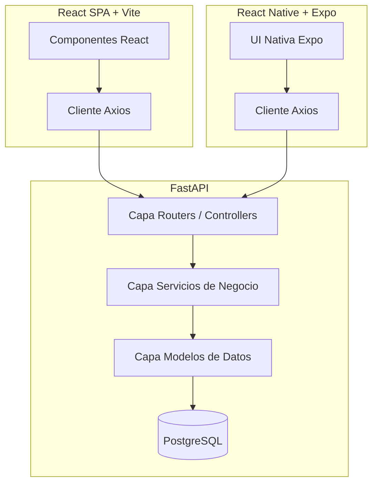

# Arquitectura de Software: Jóvenes al Ruedo

Este documento describe la arquitectura global del sistema **Jóvenes al Ruedo**, que abarca el Backend, el Frontend Web, la Aplicación Móvil y la Base de Datos.

---

## 1. Patrón de Arquitectura General

El sistema adopta una arquitectura de **Cliente-Servidor desacoplada** estructurada bajo los principios de **Clean Architecture** (Arquitectura Limpia) y separación de responsabilidades:

---

## 2. Backend (be/): FastAPI Clean & Modular

El backend está desarrollado con **FastAPI (Python 3.12+)**, estructurado para ser altamente modular y testeable.

### Estructura de Capas en Backend

* **`/app/routers/` (Capa de Presentación)**: Expone los endpoints REST HTTP. Valida parámetros de entrada mediante **Pydantic (Capa Schemas)** y delega la ejecución lógica a los servicios.
* **`/app/services/` (Capa de Lógica de Negocio)**: Contiene toda la lógica algorítmica, validación de reglas de negocio complejas (ej: rango de edad, validación de archivos).
* **`/app/models/` (Capa de Persistencia)**: Modelos relacionales estructurados con **SQLAlchemy 2.0+** que mapean objetos Python a tablas de la base de datos PostgreSQL.
* **`/app/core/` (Capa de Configuración)**: Gestión de variables de entorno con Pydantic Settings, inicialización de logging y seguridad.

---

## 3. Frontend Web (fe/): React 18+ Single Page Application

El frontend es una aplicación moderna de una sola página (SPA) construida con **React 18+**, **TypeScript 5.0+** y **Vite 6+** para una velocidad de desarrollo y compilación ultrarrápida.

### Puntos Fuertes del Frontend
* **TailwindCSS 4+**: Sistema de diseño unificado, moderno, responsivo y adaptativo.
* **React Router 7**: Gestión avanzada del enrutamiento del lado del cliente, rutas protegidas de forma nativa.
* **Axios con Interceptores**: Adjunta de manera automatizada el token JWT a todas las peticiones salientes y gestiona las respuestas de error `401 Unauthorized` de forma centralizada.

---

## 4. Aplicación Móvil: React Native con Expo

La aplicación móvil está orientada a teléfonos inteligentes enfocada en los flujos de **Registro y Login** para los jóvenes artistas.
* **Expo**: Framework robusto y ágil sobre React Native que acelera el ciclo de desarrollo en dispositivos físicos y emulados.
* **SecureStore**: Guarda de forma segura los tokens JWT del usuario localmente usando encriptación a nivel de sistema operativo.

---

## 5. Base de Datos y Orquestación

* **PostgreSQL 17**: Base de datos relacional robusta que garantiza transaccionalidad total (ACID).
* **Docker Compose**: Orquesta localmente los servicios de base de datos PostgreSQL, asegurando la consistencia del entorno entre los desarrolladores.
* **Alembic**: Control y versionamiento de migraciones de la base de datos.
