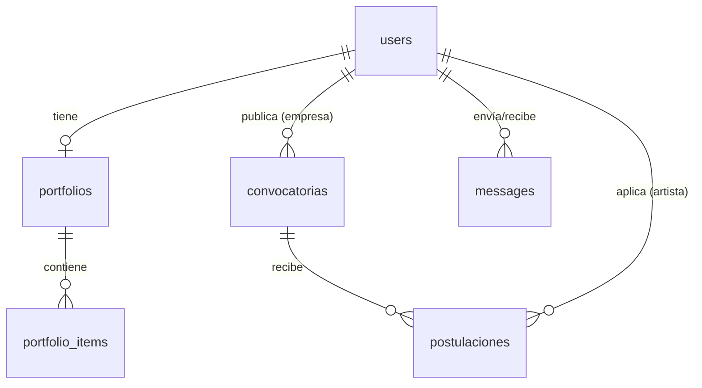

# Esquema de Base de Datos (PostgreSQL)

Este documento detalla la estructura física de las tablas del esquema relacional en PostgreSQL 17 orquestado con Docker.

---

## 1. Diagrama Entidad-Relación Conceptual

---

## 2. Definición Detallada de Tablas

### Tabla `users`
Mapea tanto a jóvenes artistas como a representantes de empresas.

| Nombre de Columna | Tipo de Datos | Restricciones | Descripción |
| :--- | :--- | :--- | :--- |
| `id` | `INTEGER` | `PRIMARY KEY`, `AUTOINCREMENT` | Identificador único del usuario. |
| `email` | `VARCHAR(255)` | `UNIQUE`, `NOT NULL` | Correo electrónico único para inicio de sesión. |
| `password_hash` | `VARCHAR(255)` | `NOT NULL` | Contraseña cifrada con `bcrypt`. |
| `full_name` | `VARCHAR(150)` | `NOT NULL` | Nombre completo o Razón Social. |
| `role` | `VARCHAR(20)` | `NOT NULL` | Rol: `'artista'` o `'empresa'`. |
| `is_active` | `BOOLEAN` | `DEFAULT FALSE` | Estado de activación por correo electrónico. |
| `birth_date` | `DATE` | `NULLABLE` | Requerido para verificar edad de artistas. |
| `artist_area` | `VARCHAR(100)` | `NULLABLE` | Área del artista (ej: Música, Danza, Plástica). |
| `created_at` | `TIMESTAMP` | `DEFAULT CURRENT_TIMESTAMP` | Fecha de creación del registro. |

### Tabla `portfolios`
Portafolio maestro del joven artista.

| Nombre de Columna | Tipo de Datos | Restricciones | Descripción |
| :--- | :--- | :--- | :--- |
| `id` | `INTEGER` | `PRIMARY KEY`, `AUTOINCREMENT` | Identificador único del portafolio. |
| `user_id` | `INTEGER` | `FOREIGN KEY (users.id)`, `UNIQUE` | Enlace al usuario de tipo artista. |
| `bio` | `TEXT` | `NULLABLE` | Biografía corta o descripción artística. |
| `social_links` | `JSON` | `NULLABLE` | Enlaces a redes sociales (Instagram, YouTube, etc). |
| `created_at` | `TIMESTAMP` | `DEFAULT CURRENT_TIMESTAMP` | Fecha de creación del portafolio. |

### Tabla `portfolio_items`
Archivos multimedia asociados al portafolio.

| Nombre de Columna | Tipo de Datos | Restricciones | Descripción |
| :--- | :--- | :--- | :--- |
| `id` | `INTEGER` | `PRIMARY KEY` | ID único de la pieza multimedia. |
| `portfolio_id` | `INTEGER` | `FOREIGN KEY (portfolios.id)` | Portafolio padre. |
| `file_url` | `VARCHAR(500)` | `NOT NULL` | URL de acceso local o en la nube al archivo. |
| `file_type` | `VARCHAR(20)` | `NOT NULL` | `'image'`, `'audio'`, `'video'`, `'document'`. |
| `description` | `VARCHAR(255)` | `NULLABLE` | Breve reseña del ítem por parte del artista. |

### Tabla `convocatorias`
Ofertas laborales o retos publicados por empresas.

| Nombre de Columna | Tipo de Datos | Restricciones | Descripción |
| :--- | :--- | :--- | :--- |
| `id` | `INTEGER` | `PRIMARY KEY` | ID único de la convocatoria. |
| `empresa_id` | `INTEGER` | `FOREIGN KEY (users.id)` | Empresa que crea la oferta. |
| `title` | `VARCHAR(200)` | `NOT NULL` | Título de la oferta. |
| `description` | `TEXT` | `NOT NULL` | Requisitos y especificaciones detalladas. |
| `budget` | `NUMERIC(12,2)` | `NOT NULL` | Presupuesto ofertado para la contratación. |
| `deadline` | `DATE` | `NOT NULL` | Fecha máxima de postulación. |
| `created_at` | `TIMESTAMP` | `DEFAULT CURRENT_TIMESTAMP` | Fecha de registro en base de datos. |

### Tabla `postulaciones`
Interacción de postulaciones entre artistas y ofertas.

| Nombre de Columna | Tipo de Datos | Restricciones | Descripción |
| :--- | :--- | :--- | :--- |
| `id` | `INTEGER` | `PRIMARY KEY` | ID de la postulación. |
| `convocatoria_id` | `INTEGER` | `FOREIGN KEY (convocatorias.id)` | Convocatoria aplicada. |
| `artista_id` | `INTEGER` | `FOREIGN KEY (users.id)` | Artista postulante. |
| `status` | `VARCHAR(30)` | `DEFAULT 'pendiente'` | `'pendiente'`, `'revisado'`, `'aceptado'`. |
| `applied_at` | `TIMESTAMP` | `DEFAULT CURRENT_TIMESTAMP` | Fecha de envío de postulación. |
